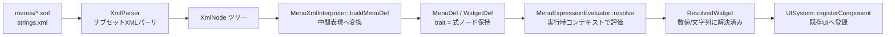
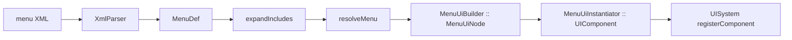

# Oblivion Android - メニューXMLインタプリタ設計書

**作成日**: 2026-10-05
**バージョン**: 0.2（M3 完了反映）
**ステータス**: 調査完了 / M1〜M3 実装完了（MenuUiBuilder は M4 へ延期）
**関連TODO**: `impl-menu-xml-interpreter`（完了）, `impl-menu-xml-m3`（完了）
**対象データ**: `D:\Cargo\Ghidra\temp\Oblivion_Steam版\Data\Oblivion - Misc.bsa` の `menus\*.xml`（89個）

## 1. 概要

### 1.1 目的

Oblivion Steam版のメニューXML（`menus\*.xml`）をパース・評価し、既存のC++ UIシステム（`ui/` 配下の UISystem / UIComponent）へ変換・登録するための**メニューXMLインタプリタ**を実装する。これにより、原作のメニューレイアウト（ロード画面、タイトル、設定、インベントリ等）を定義データから再現できるようにする。

### 1.2 スコープ（本設計の対象）

- XMLパーサ（サブセット、lenient 回復を含む）
- 式評価器（演算子・参照・trait評価）
- 中間表現（MenuDef / WidgetDef / TemplateDef / IncludeDef）
- `MenuDef` → `ResolvedWidget` / `ResolvedMenu` の解決（座標・サイズ・状態の数値化）
- 既存UIコンポーネントへの変換・登録インターフェース（§5.5、M4）

### 1.3 対象外（将来拡張）

- 完全なScaleform/フラッシュ互換
- `<nif>`（3Dウィジェット）のレンダリング統合
- リストビュー（`<clips>` / `<clipwindow>`）のスクロールUI統合（`ResolvedWidget` はフラグまで）
- アニメーション（`<animation>`）の再生
- コントローラボタン割り当て（`<xbutton*>`）の実機入力バインド

### 1.4 参照設計

`docs/ASSET_GUIDE.md` L380-390 に既存の設計意図あり（`engine/xml_menu_parser.h/cpp` 新規作成、対応要素 `<rect>/<image>/<text>/<template>`、`UISystem::registerComponent()` で動的生成）。本設計書はこれを発展させ、実際のXMLフォーマット分析に基づいて具体化する。配置は既存UIとの一貫性から `ui/` 配下を採用する（ASSET_GUIDEの `engine/` 記載は古い計画のため、本設計書を正とする）。

## 2. 背景：Oblivion メニューXMLフォーマット

各メニューは1つのルート `<menu>` 要素を持つXMLファイルで定義される。`loading_menu.xml` の実例：

```xml
<menu name="LoadingMenu">
    <class> &LoadingMenu; </class>
    <stackingtype> &no_click_past; </stackingtype>
    <alpha> 0 </alpha>
    <locus> &true; </locus>
    <x> 0 </x>
    <y> 0 </y>
    <menufade> 0.25 </menufade>
    <user0> &false; </user0>

    <rect name="black">
        <depth> 0 </depth>
        <red> 0 </red>
        <green> 0 </green>
        <blue> 0 </blue>
        <alpha> 1 </alpha>
        <width> <copy src="screen()" trait="width"/> </width>
        <height> <copy src="screen()" trait="height"/> </height>
    </rect>

    <image name="load_title_page">
        <filename> Menus\Loading\loading_background.dds </filename>
        <depth> 30 </depth>
        <x>
            <copy src="screen()" trait="width"/>
            <sub src="me()" trait="width"/>
            <div> 2 </div>
        </x>
        <y>
            <copy src="screen()" trait="height"/>
            <sub src="me()" trait="height"/>
            <div> 2 </div>
        </y>
    </image>
</menu>
```

特徴：

- ウィジェットは `name` 属性を持つツリー構造（`<rect>` はコンテナを兼ね、子ウィジェットを持つ）
- 各 trait（`x` / `y` / `width` / `alpha` 等）の値は**リテラル**または**式**（演算子要素の入れ子）
- 式は累積レジスタ方式で評価される（後述 §6）
- 参照元は `screen()` / `parent()` / `me()` / `strings()` / 名前付きウィジェット・メニュー

## 3. フォーマット分析（全89XMLの網羅調査に基づく）

### 3.1 要素分類

| 分類 | 要素 | 説明 |
|---|---|---|
| ルート | `menu` | 1メニュー。`name` 必須 |
| ウィジェット | `rect`, `image`, `text`, `nif` | 矩形 / 画像 / テキスト / 3Dメッシュ |
| 再利用 | `include`, `template`, `prefab` | 外部XMLインクルード / リスト要素定義（§3.6） |
| 参照 | `ref` | 他ウィジェットのtraitへの参照 |
| コントローラ | `xbuttona/b/lb/lt/rb/rt/x/y`, `xdefault`, `xdown`, `xleft`, `xlist`, `xright`, `xscroll`, `xup` | ボタン割り当て |
| リスト | `clips`, `clipwindow`, `listclip`, `listindex` | リストビュー |
| その他 | `animation`, `id`, `mult` | アニメーション等 |

### 3.2 trait（属性）

各ウィジェットは以下の trait を持つ（trait名 = ウィジェット直下の子要素名）。

**共通**:
- 配置: `x`, `y`, `width`, `height`, `depth`, `locus`（中央基準か）
- 描画: `alpha`, `red`, `green`, `blue`, `visible`, `zoom`
- メニュー制御: `class`, `stackingtype`, `menufade`, `explorefade`, `focusinset`, `target`
- ユーザー定義: `user0` 〜 `user25`（メニューごとに意味が異なる。コード側との通信に使う）
- その他: `cropx`, `depth3d`, `clicksound`, `pagenum`, `wraplimit`, `wraplines`

**image**: `filename`（DDSパス）, `depth`, `x/y/width/height`, `zoom`

**text**: `string`（文字列参照）, `font`, `justify`（`&left;` 等）, `wrapwidth`, `ishtml`, `_pagenum` 等のカスタムtrait

### 3.3 演算子要素（式）

| 演算子 | 意味 | 実例 |
|---|---|---|
| `copy` | 参照値の取得・累積初期化 | `<copy src="screen()" trait="width"/>` |
| `add` | 加算 | `<add> 510 </add>`, `<add src="BookMenu" trait="user6"/>` |
| `sub` | 減算 | `<sub src="me()" trait="width"/>`, `<sub> <copy .../> <mul> 2 </mul> </sub>` |
| `mul` | 乗算 | `<mul> 2 </mul>` |
| `div` | 除算 | `<div> 2 </div>` |
| `mod` | 剰余 | - |
| `max` / `min` | 最大 / 最小 | `<min> <copy src="book_page_1_text" trait="pagecount"/> </min>` |
| `eq` `gt` `gte` `lt` `lte` `neq` | 比較（bool） | `<gt> 0 </gt>` |
| `and` / `or` | 論理積 / 和 | - |
| `floor` / `ceil` | 切り捨て / 切り上げ | - |
| `onlyif` / `onlyifnot` / `onlynotif` | 条件付き適用（直後の演算子をスキップ） | `<onlyifnot src="me()" trait="user0"/>` |
| `not` | 論理否定（単項。累積シーケンスに入らない） | `<not> <copy src="me()" trait="user0"/> </not>` |
| `rand` | 乱数（単項。`<rand> N </rand>` で 0〜N-1） | - |
| `mult` | `mul` の別名（`book_menu.xml` に実在） | `<mult> 33 </mult>` |

### 3.4 参照元

| 参照 | 解決内容 | 実例 |
|---|---|---|
| `screen()` | 画面寸法。`trait="width"/"height"` | `<copy src="screen()" trait="width"/>` |
| `parent()` | 親ウィジェットのtrait | `<copy src="parent()" trait="height"/>` |
| `me()` | 自分自身のtrait | `<sub src="me()" trait="width"/>` |
| `strings()` | 文字列定数 | `<copy src="strings()" trait="_loading"/>` |
| `メニュー名` | 他メニュー名（`name` 属性）のtrait | `<add src="BookMenu" trait="user6"/>` |
| `ウィジェット名` | 名前付きウィジェットのtrait | `<copy src="book_prev" trait="clicked"/>` |
| `child(NAME)` | 直下の子ウィジェットのtrait | `<copy src="child(quantity_scroll)" trait="x"/>` |
| `sibling(NAME)` | 同じ親を持つ兄弟ウィジェットのtrait | `<copy src="sibling(okay)" trait="y"/>` |
| `last()` | 同じ親の最後の兄弟ウィジェットのtrait | `<copy src="last()" trait="y"/>` |

`child()` は直接の子のみ、`sibling()` / `last()` は同じ親の子リストを対象とする。親を持たない（メニュー直下の）ウィジェットでは `sibling()` / `last()` はメニューの直下タイル列を対象とする。

### 3.5 エンティティ・文字列定数

- `strings.xml` はルートが `<rect name="Strings">` で、子に `<name>値</name>` の定数定義を持つ（`_loading` → `Loading...` 等、数百件）
- XML内では `&name;` 形式で参照される。文字列定数だけでなく、`&true;` / `&false;` / `&left;` / `&center;` / `&right;` / `&no_click_past;` / `&LoadingMenu;` 等の定義済み定数がある
- エンティティ解決は「同名 `<name>` 要素のテキストを返す」方式

### 3.6 再利用機構

- `<include src="button_short.xml"/>` — 外部XMLを**その位置に展開**する。展開規則は §5.6 を参照
- `<template name="class_template"> ... </template>` — リスト要素（行）の定義。`<copy src="class_template" trait="..."/>` 等で参照される（class_menu で使用）
- `<prefab name="..."> ... </prefab>` — `template` と同じ「リスト要素定義」。`name` 属性を持たない body 要素は trait ではなく定義本体の属性として扱う

`template` / `prefab` は描画されるタイルではなく、**エンジンコード側がリスト行としてインスタンス化する雛形**である（原作コメント "list items are added here in code from the template" と一致）。そのため `MenuDef::templates` に保持したまま展開せず、`MenuXmlInterpreter::findTemplate()` で名前引きできる形で公開する。

### 3.7 実データのマークアップ崩れ（lenient 回復）

原作同梱の89 XML には、閉じタグの書き間違いが数箇所ある。strict パースでは文書全体が読めなくなるため、パーサは lenient モードで次の**2種類**の回復を行う（`buildMenuDef()` と `parseFragment()` は lenient 固定）。

| パターン | 実例 | 回復動作 |
|---|---|---|
| adopt（祖先が閉じタグを採用） | `options/video_menu.xml` の `<y> ... <y> ... </text>` | 閉じタグ名が `open_stack` に存在し、それより深い開要素が**すべて名前なし（＝trait）**のとき、その祖先が閉じタグを採用する。誤記の内側要素は捨てられ、中身は採用した祖先の children 末尾へ移される（`XmlNode::lenient_adopted_by` + `repairAdoptions()`） |
| 最内閉じ | `quantity_menu.xml` の `</rect>` で `<image>` を閉じる | 祖先に名前付きウィジェットが挟まる場合は adopt せず、最内の開要素をその閉じタグで閉じる |

**adopt の重要な性質（実測で確定）**

- 閉じタグを採用した祖先は、その閉じタグを**自分で消費するまで解析を続ける**。中間フレームだけが早期終了する。この「所有者フレーム継続」が無いと閉じタグが誰にも消費されず、以降の文書が丸ごと切り捨てられる（`options/video_menu.xml` で実際に発生していた不具合の真因）。
- 実データの adopt は3件のみ（`main\hud_main_menu.xml` の `</image>`、`options\video_menu.xml` の `</text>` ×2）。strict モードの挙動には一切影響しない。
- 閉じられていないコメント（`<!--` に対応する `-->` が無い）は lenient では「以降を文書終端までコメント扱い」、strict では **エラー**とする。実コーパスに該当 0 件。

## 4. アーキテクチャ設計

### 4.1 パイプライン



### 4.2 ファイル構成

```
app/src/main/cpp/ui/
├── xml_parser.h / xml_parser.cpp          # サブセットXMLパーサ（新規）
├── menu_xml_interpreter.h / .cpp          # 中間表現 + 評価器 + 変換（新規）
└── (既存) ui_system.h, ui_component.h, ...

tools/host_tests/
├── tests/menu_xml_tests.h / .cpp          # ホストテスト（新規、GL不要）
├── host_runner_main.cpp                   # runSuite 追加（編集）
└── run_host_tests.sh                      # SOURCES に追加（編集）
```

## 5. API設計

### 5.1 サブセットXMLパーサ

```cpp
namespace oblivion::ui {

// ノード（パーサ出力）
struct XmlNode {
    std::string name;
    std::map<std::string, std::string> attributes;  // 例: name, src, trait
    std::vector<XmlNode> children;
    std::string text;  // リーフのテキスト内容（数値・文字列リテラル）
};

class XmlParser {
public:
    // XMLテキストをパースしてルートノードを返す。失敗時は false + error 設定
    static bool parse(const std::string& xml, XmlNode& root, std::string& error);
};

}  // namespace oblivion::ui
```

対応構文（サブセット）:
- 開始/終了タグ、自己終了タグ（`<ref .../>`）
- 属性（`name`, `src`, `trait` 等。ダブルクォート）
- テキスト内容（コメント・CDATAは読み飛ばし）
- 未対応: 名前空間、DTD、処理命令（無視して続行）

### 5.2 中間表現

```cpp
namespace oblivion::ui {

// trait定義（式ノードを保持）
struct TraitDef {
    std::string name;
    XmlNode expr;       // 式のルートノード（copy/add/リテラル等）
    bool has_expr;
};

// ウィジェット定義
struct WidgetDef {
    std::string name;
    std::string type;                          // "rect" | "image" | "text" | "nif" | ...
    std::map<std::string, TraitDef> traits;    // trait名 → 式
    std::vector<WidgetDef> children;           // 子ウィジェット（rect はコンテナ）
    std::vector<IncludeDef> includes;          // このタイル直下の <include>
};

// メニュー定義
struct MenuDef {
    std::string name;
    std::map<std::string, TraitDef> traits;    // メニューレベルのtrait
    std::vector<WidgetDef> widgets;
    std::vector<IncludeDef> includes;          // 未解決 include（§5.6 で展開）
    std::vector<TemplateDef> templates;        // リスト要素定義（展開しない）
};

}  // namespace oblivion::ui
```

### 5.3 式評価器

```cpp
namespace oblivion::ui {

// 評価値（Null は「値なし」。未定義参照は Null になる）
struct EvalValue {
    enum class Type { Null, Number, String, Bool };
    Type type = Type::Null;
    float number = 0.0f;
    std::string string;
    bool boolean = false;
};

// 実行時コンテキスト
struct MenuEvalContext {
    float screen_width  = 0.0f;
    float screen_height = 0.0f;
    const MenuDef* menu_def        = nullptr;   // 現在のメニュー
    const WidgetDef* widget_def    = nullptr;   // 現在評価中のウィジェット
    const WidgetDef* parent_widget = nullptr;   // 親ウィジェット
    const std::map<const WidgetDef*, const WidgetDef*>* parents = nullptr;  // 祖先探索用
    bool self_is_menu = false;                  // me() がメニュー自身を指すか
    const std::map<std::string, std::string>* strings = nullptr;  // 文字列定数
    // テクスチャの実ピクセル寸法（filewidth/fileheight trait と image 自動サイズに使用）
    std::function<bool(const std::string& filename, float& width, float& height)> texture_size;
    // 文字列の描画寸法（text タイルは width を宣言しないため計測が必要）
    std::function<bool(const std::string& text, const std::string& font,
                       float& width, float& height)> text_size;
};

class MenuExpressionEvaluator {
public:
    // 式ノードを評価する（累積レジスタ方式）
    static EvalValue evaluate(const XmlNode& expr, const MenuEvalContext& ctx);

    // trait名から値を引く（me() / parent() / 名前付きウィジェット対応）
    static EvalValue traitValue(const std::string& source, const std::string& trait,
                                const MenuEvalContext& ctx);
};

}  // namespace oblivion::ui
```

### 5.4 解決器（評価後のウィジェット）

```cpp
namespace oblivion::ui {

// 評価済みウィジェット（既存UIへ渡す値）
struct ResolvedWidget {
    std::string name;
    std::string type;                 // "rect" | "image" | "text" | "nif" | ...
    float x = 0.0f, y = 0.0f;         // 親タイル左上からの相対座標（locus でも不変）
    float width = 0.0f, height = 0.0f;
    float abs_x = 0.0f, abs_y = 0.0f; // メニュー原点 + 親チェーンの累積
    float depth = 0.0f;
    float alpha = 1.0f;
    float red = 0.0f, green = 0.0f, blue = 0.0f;
    float zoom = 1.0f;                // trait の生値
    float zoom_scale = 1.0f;          // zoom > 0 なら zoom/100、それ以外 1.0
    bool fill_rect = false;           // zoom < 0: タイル矩形に合わせて拡大縮小
    float texture_width = 0.0f, texture_height = 0.0f;  // 実ピクセル寸法（0 = 不明）
    float texture_scale = 0.0f;       // zoom < 0 の一様フィット倍率（0 = 不明）
    bool has_texture = false;
    bool has_text_extent = false;     // width/height を文字列計測から埋めた
    bool visible = true;
    bool locus = false;               // <locus> フラグ（レイアウトは常に左上基準、§5.4.1）
    bool clip_window = false;         // <clipwindow>: 子をこの矩形でクリップ
    bool clips = false;               // <clips>: 自身が親にクリップされる
    bool clipped = false;             // 祖先に <clipwindow> がある
    std::string filename;             // image 用（DDSパス）
    std::string string;               // text 用
    std::string font;
    std::string justify;              // text 用（&left; / &center; / &right;）
    std::map<std::string, EvalValue> user_traits;  // user0-25 等
    std::map<std::string, EvalValue> traits;       // 評価済みの全 trait
    std::vector<IncludeDef> includes;              // 未解決 <include>
    std::vector<ResolvedWidget> children;
};

// 解決済みメニュー（メニュー自身の trait も評価する）
struct ResolvedMenu {
    std::string name;
    float x = 0.0f, y = 0.0f;         // メニュー原点
    float width = 0.0f, height = 0.0f;
    float depth = 0.0f;
    float alpha = 1.0f;
    bool visible = true;
    std::map<std::string, EvalValue> traits;
    std::vector<IncludeDef> includes;
    std::vector<ResolvedWidget> widgets;
};

class MenuXmlInterpreter {
public:
    static constexpr int kMaxIncludeDepth = 8;

    // XML文字列 → MenuDef（式ノード保持のまま）
    static bool buildMenuDef(const std::string& xml, MenuDef& out, std::string& error);

    // MenuDef + 実行時コンテキスト → 解決済みウィジェットツリー
    static std::vector<ResolvedWidget> resolve(const MenuDef& def,
                                               const MenuEvalContext& ctx);

    // メニュー自身の trait も解決する版
    static ResolvedMenu resolveMenu(const MenuDef& def, const MenuEvalContext& ctx);

    // <include src="..."/> を loader で読み込んで再帰的に展開する（§5.6）
    using XmlSourceLoader = std::function<bool(const std::string& src, std::string& xml_out)>;
    static bool expandIncludes(MenuDef& def, const XmlSourceLoader& loader,
                               std::string& error, int max_depth = kMaxIncludeDepth);
    static std::size_t countIncludes(const MenuDef& def);
    static const TemplateDef* findTemplate(const MenuDef& def, const std::string& name);
};

}  // namespace oblivion::ui
```

#### 5.4.1 locus / zoom の確定規則

`locus`（中央基準）は**レイアウトに影響しない**ことが実データで確定した。`x` / `y` は `locus` の有無にかかわらず親タイル左上からの左端・上端オフセットである。

- 根拠1: `Menus\main\inventory_menu.xml` の5つの locus タブは `x = 28/165/304/443/578, y = 37`。中央基準なら負値または重複した値になるが、左端解釈でのみ横並びに成立する。
- 根拠2: `Menus\loading_menu.xml` は全画面画像に `<locus>` と `<x>0</x>` を持つ。中央基準なら原点がずれる。
- 中央寄せは式で手書きされている（`(screen().width - me().width) / 2`）。`text` は `justify` が伸長方向を決め、`x/y` はアンカー位置になる。

`zoom` は生値で保持し、次の2通りに解釈する。

| zoom | `fill_rect` | `zoom_scale` | 意味 |
|---|---|---|---|
| 負値 | true | 1.0（`texture_scale` に実倍率） | タイル矩形に合わせて一様フィット |
| 正值 | false | `zoom / 100` | パーセント倍率 |

### 5.5 既存UIへの統合インターフェース（M4）

M4 で `MenuUiBuilder`（`ResolvedWidget` → GL非依存の `MenuUiNode` へ変換）と `MenuUiInstantiator`（`MenuUiNode` → `UIComponent` / `UISystem` へ実体化）を実装した。

**2層構成の理由**: `UIComponent` の生成・`UISystem` への登録は GL コンテキストが必要だが、変換規則自体は純ロジックである。変換を `MenuUiBuilder` に隔離することで、ホストテスト（§8）が実機なしで変換全体を検証できる。

| 変換 | 規則 |
|---|---|
| `rect` | 矩形 `UIComponent`。色 = red/green/blue/alpha を **0..255 → 0..1 へ正規化**（実データの alpha 値は 0/160/200/255 の4値のみ）。`<alpha>` を宣言しないタイルは **1.0（完全不透明）** を保持する |
| `image` | テクスチャ付き `UIComponent`。`filename` は basename 抽出 + 拡張子置換（DDS→PNG）で `textures/ui/<base>.png` へ解決する。`fill_rect`（zoom<0）→ `PRESERVE_ASPECT_FIT`、それ以外 → `STRETCH`。zoom>0 は `zoom_scale` として保持し、ネイティブ寸法（`texture_width/height`）も引き継ぐ |
| `text` | 専用 `MenuTextComponent`（`UIComponent` 派生）。`justify` で文字列計測後のアンカー補正（left/center/right）、`wrap_width` 保持、`font` は `fontIndex()` で `TextRenderer::FontType` へマップ |
| 座標 | **`x` / `y`（親タイル左上からの相対）と `width`/`height` をそのまま `setPosition`/`setSize` へ渡す**。**`abs_x` / `abs_y` は使わない**。理由: `UIComponent::getAbsolutePosition()` が親チェーンを再加算するため、`abs_*` を使うと二重計上になる（§5.4.1 の `locus` 中央基準変換は行わない方針と整合） |
| `<nif>` 等の非描画タイル | `Ignored` にマップし、children は親へ繰り上げて保持する |

#### 5.5.1 ホスト → 実機のデータフロー



`MenuEvalContext::text_size` / `texture_size` フックは instantiator の `makeTextSizeHook()` / `makeTextureSizeHook()` で接続し、実フォント・実テクスチャ寸法を式評価へ供給する。`MenuTextComponent` の描画は `UIComponent` が持たないため、`UIButton::renderLabel()` を流用せず専用実装とした（ボタン状態を持つため流用不可）。

### 5.6 `<include>` 展開規則

`expandIncludes()` は次の規則で `MenuDef` を破壊的に展開する。

| 対象 | 動作 |
|---|---|
| `<include>` が持つ `<name>値</name>` 形式の trait | その所有者（メニュー or タイル）の trait へマージする。**所有者側に同名 trait が既にあれば上書きしない**（＝所有者の自前定義が勝つ） |
| `<include>` 内の `name` 属性付きタイル | `IncludeDef::index`（＝展開位置）に挿入する。以降のタイルは後ろへずれる |
| `<template>` / `<prefab>` | 展開せず `MenuDef::templates` に保持（§3.6） |
| 循環・深いネスト | 1つの枝で同じ `src` を2度展開しない。深さ上限は `kMaxIncludeDepth = 8` |
| 展開後 | `includes` は空になる（`countIncludes(def) == 0` が正常） |

## 6. 式評価セマンティクス（累積レジスタ方式）

### 6.1 基本ルール

- trait要素の子/テキストは**式**として評価され、単一の値（`EvalValue`）を返す
- 式の評価は「累積レジスタ」方式:
  1. **初期化**: 最初の子要素を評価して累積値をセット。子が無くテキストのみの場合は数値/文字列リテラルをセット（`<x> 0 </x>` → 0、`<filename> ... </filename>` → 文字列）
  2. **後続の子要素**: 累積値に対して演算子を適用し累積値を更新
- 参照値の取得は `copy`（`src` + `trait` 属性）

### 6.2 演算子の適用規則

| 式 | 動作 |
|---|---|
| `<x> 0 </x>` | リテラル → 累積 = 0 |
| `<copy src="screen()" trait="width"/>` | 累積 = screen.width |
| `<add> 510 </add>` | 累積 += 510 |
| `<add src="BookMenu" trait="user6"/>` | 累積 += BookMenu.user6 |
| `<sub src="me()" trait="width"/>` | 累積 -= me().width |
| `<div> 2 </div>` | 累積 /= 2 |
| `<mul> 2 </mul>` | 累積 *= 2（`<mult>` は `<mul>` の別名） |
| `<max>` / `<min>` | 累積 = max/min(累積, 子の評価結果) |
| `<eq>` `<gt>` `...` | 累積 = 比較結果(bool) |
| `<sub> <copy .../> <mul> 2 </mul> </sub>` | 子1で累積初期化（book_prev.clicked）→ 子2 `<mul> 2 </mul>` で ×2 → 累積 = book_prev.clicked − (book_prev.clicked × 2) |

**実装時の確定セマンティクス**（実XML `_pagenum` 等で検証済み）:

- **演算子が最初の子の場合**はゼロシード（`0`）から開始する。例: `<add> 1 </add><add> 2 </add>` → `0 + 1 + 2 = 3`
- **混合コンテンツ**（trait要素自身の非空白テキスト + 子要素）は、そのテキストを先頭の暗黙リテラルシードとして扱う。例: `<x> 10 <add> 5 </add> </x>` → `10 + 5 = 15`。空白のみのテキストは無視（純粋な演算子連鎖はゼロシードを維持）
- **`<mult>` は `<mul>` の別名**（book_menu.xml に `<mult> 33 </mult>` が存在）
- **`<onlyif>` / `<onlyifnot>`** は次の演算子をスキップするゲート。`<onlyif>&false;</onlyif><add> 5 </add>` → `add` はスキップ
- **演算子の src 属性**: `<add src="screen()" trait="width"/>` はオペランドを参照解決して適用
- **trait 要素の子テキストと属性の混在**: `<max> 0 </max>` のように子の無い演算子は自身のテキストをオペランドとする

### 6.3 数値 vs 文字列

- 数値演算（add/sub/div/mul/mod/max/min）は `Number` 同士のみ適用。文字列が混在した場合は `Number` へ変換を試み、失敗時はエラー
- `string` / `filename` / `font` trait は `String` を返す
- 比較・論理演算は `Bool` を返す

## 7. 実装ロードマップ

| マイルストーン | 内容 | 検証 | 状態 |
|---|---|---|---|
| **M1** | XmlParser + XmlNode + ホストテスト（実XMLをパースしてツリー構造を検証） | host_tests | 完了 |
| **M2** | 評価器（copy/add/sub/div/mul/mult/max/min/onlyif/not/rand 等 + screen()/me()/parent()/strings()/child()/sibling()/last()/名前参照） | host_tests | 完了 |
| **M3** | buildMenuDef / resolveMenu による MenuDef→ResolvedWidget/ResolvedMenu 変換、include 展開、templates 保持、lenient 回復、locus/zoom 規則確定、text 計測フック | host_tests + 実コーパス89件 + `:app:externalNativeBuildDebug` | 完了（MenuXmlTests 142ケース PASS） |
| **M4** | MenuUiBuilder（ResolvedWidget → MenuUiNode）+ MenuTextComponent + MenuUiInstantiator（MenuUiNode → UIComponent）+ 実メニュー適用（loading_menu → ロード画面） | host_tests + 実機 + logcat | 実装中（Builder/Instantiator 実装・ホストテスト184ケース PASS。画面適用は次段階） |

M3 の完了条件は「実コーパス89 XML がすべて解析でき、座標・サイズ・状態が数値として解決される」こと。`MenuUiBuilder` / `MenuUiInstantiator` は M4 で実装した（§5.5）。

## 8. テスト計画（ホストテスト）

- `app/src/main/cpp/tests/menu_xml_tests.h/cpp`（GL不要の純ロジックのみ）※ `tools/host_tests/` から参照
- 実際のテスト構成（**184ケース / 全PASS**）:

| # | セクション | 内容 |
|---|---|---|
| 1 | parser | ツリー構造・trait・エンティティ、strict での不正XML拒否 |
| 2 | buildMenuDef | trait/widget/include/template の収集 |
| 3–4 | 式評価 | リテラル・演算子チェーン、`strings()` 解決 |
| 5–6 | 参照 | `me()` / `parent()` / 名前付きウィジェット、実 `book_menu.xml` の `_pagenum` 累積 |
| 7 | ゲート | `onlyif` / `onlyifnot` |
| 8–9 | resolve | 解決済み値、`not` / `rand` / `onlynotif` |
| 10 | 参照拡張 | `child()` / `sibling()` / `last()` |
| 11 | zoom | パーセント倍率と「矩形フィット」の分岐、`texture_scale` |
| 12 / 12b | locus | `locus` がレイアウトに影響しないこと（実 `inventory_menu.xml` の locus タブで検証） |
| 13 | クリップ | `clips` / `clipwindow` / 祖先伝播 |
| 14 | templates | `template` / `prefab` の保持と `findTemplate()` |
| 15 | include | 展開・trait マージ・挿入位置・再帰 |
| 16 | 未知名 trait | `filewidth` / `fileheight` と未知 trait の保持 |
| 17 | 実コーパス | `loading_menu.xml` の zoom / locus / text 計測 |
| 18 / 18b–18d | lenient 回復 | adopt 修復、最内閉じ、フラグメントの adopt、trait マージ優先順位、未終端コメント |
| 19 | M4 builder | テクスチャパス変換 / fontIndex / 色正規化（0..255→0..1） / scale_mode / justify 解決 / 再帰 / `loading_menu.xml` 形の統合 build |

- `run_host_tests.sh` の SOURCES に `xml_parser.cpp` / `menu_xml_interpreter.cpp` / `menu_ui_builder.cpp` を追加（依存ポリシー: leaf 依存のみ、GLES/NDK は stub で回避。`MenuUiInstantiator` は GL 依存のためホストから除外）
- `host_runner_main.cpp` に `MenuXmlTests` スイートを追加
- 実コーパス回帰チェック: `MENUS 60 FRAGMENTS 25 EMPTY 4 PARSE_FAIL 0 EXPAND_FAIL 0 WIDGETS 203 ALL 2651 INCLUDES 0`（`tmp/menu_xml_corpus.exe`）

## 9. 制約・前提・リスク

### 制約・前提

- C++17 / Android NDK r26.1。外部XMLライブラリは追加せず自作サブセットパーサ
- 実XML（`tmp/bsa_misc_full/menus/*.xml`、89個）が仕様の一次情報源
- `strings.xml` の定数は実行時にロードして参照解決に使用
- コメントは英語、ユーザー向け文字列はバイリンガル

### リスク

| リスク | 影響 | 対策 |
|---|---|---|
| 式評価の累積セマンティクス（§6.2 の単独演算子子） | 座標・サイズが原作とずれる | 解決済み（§6.2 実装時確定。`_pagenum` 等を入力に MenuXmlTests で検証） |
| `<include>` / `<template>` / `<prefab>` の展開 | メニュー構造が不完全 | 解決済み。include は §5.6 の規則で展開、template/prefab はリスト行の雛形として保持（§3.6） |
| `strings.xml` のエンティティ量が多い | パースが重い | 定数は起動時1回ロードしてキャッシュ |
| `locus` の解釈 | 表示ズレ | 解決済み。実データ2件の根拠から「レイアウトに影響しない」と確定（§5.4.1）。M4 でも `x` / `y` をそのまま使う |
| 原作データの閉じタグ誤記 | 文書の切り捨て・trait 欠落 | 解決済み。lenient 回復（§3.7）。adopt は3件のみ、strict には影響なし。コーパス回帰チェックで `PARSE_FAIL 0` を維持 |
| text の描画寸法 | 中央寄せラベルがずれる | 部分対応済み。`makeTextSizeHook()` が実フォント計測を式評価へ接続（§5.5.1）。実機の目視確認は画面適用の次段階 |
| BSA内DDSパスとアセットパスの解決 | 画像表示不能 | 解決済み。`convertTexturePath()` が basename 抽出 + PNG 拡張子へ解決（§5.5）。実機のテクスチャ表示は画面適用次段階で確認 |
| `MenuUiBuilder` 未実装 | 実際の画面には未反映 | 解決済み。M4 で Builder / Instantiator / MenuTextComponent を実装し、ホストテスト184ケース PASS。実メニューの画面適用は次段階 |

## 10. 参考資料

- 実XML: `tmp/bsa_misc_full/menus/*.xml`（89個、`loading_menu.xml` / `book_menu.xml` / `strings.xml` が代表例）
- 既存UI: `app/src/main/cpp/ui/ui_system.h`, `ui_component.h`, `ui_button.*`, `ui_panel.*`
- M4: `app/src/main/cpp/ui/menu_ui_builder.{h,cpp}`, `menu_text_component.{h,cpp}`, `menu_ui_instantiator.{h,cpp}`
- ホストテスト基盤: `tools/host_tests/README.md`, `run_host_tests.sh`, `host_runner_main.cpp`
- 実装: `app/src/main/cpp/ui/xml_parser.{h,cpp}`, `app/src/main/cpp/ui/menu_xml_interpreter.{h,cpp}`, `app/src/main/cpp/tests/menu_xml_tests.{h,cpp}`
- 設計意図: `docs/ASSET_GUIDE.md` L380-390
- UI資産: `docs/RE_UI_TEXTURE_REPORT.md`（`textures\menus` 正典と抽出結果）
